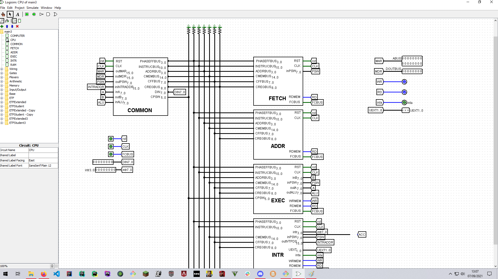

# 16-bit-Processor-Scheme

 

### 16-bit CPU architecture scheme based on registers, address buses and data buses made in Logisim simulator.

 Processor can store 2^16 different values and can directly access 64 KB (65,536 bytes) of byte-addressable memory. The range of integer values that can be stored depends on the integer representation used. 

 

